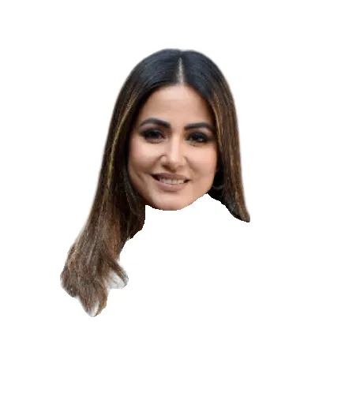

# Face Segmentation Tool

A powerful web application for precise face segmentation and background removal. This tool uses deep learning to extract faces from images with high accuracy, maintaining details like glasses, hair, and facial features.

## Features

- **Face Detection**: Automatically identifies a single face in the uploaded image
- **Background Removal**: Cleanly removes backgrounds from portrait images
- **Face Segmentation**: Precisely extracts facial features including skin, eyes, eyebrows, nose, mouth, and hair
- **Edge Refinement**: Uses advanced techniques to create smooth, natural-looking edges
- **Transparent Output**: Downloads images with transparent backgrounds, ready for use in designs

## Examples

### Input Image


### Output Results
| Segmented Face | Background Removed | Face Mask |
|:---:|:---:|:---:|
|  |  |  |

<!-- ## Live Demo

Try the tool yourself at: [https://face-segmentation-tool.onrender.com](https://face-segmentation-tool.onrender.com)

*Note: The free deployment may take a moment to wake up if it hasn't been used recently.* -->

## How It Works

1. **Face Verification**: Confirms the image contains exactly one human face
2. **Background Removal**: Uses the `rembg` library to remove the background
3. **Face Segmentation**: Uses the BiSeNet model to segment facial features
4. **Advanced Edge Refinement**: Uses contour extraction, GrabCut, and polynomial approximation for smooth edges
5. **Mask Cleanup**: Applies morphological operations to refine the segmentation

## Technical Architecture

The application combines several advanced computer vision techniques:

- **Face Detection**: OpenCV's Haar Cascade classifier
- **Background Removal**: [rembg](https://github.com/danielgatis/rembg) library
- **Face Parsing**: [BiSeNet](https://github.com/zllrunning/face-parsing.PyTorch) deep learning model
- **Edge Enhancement**: Custom algorithm for glasses and thin facial features
- **Mask Refinement**: GrabCut algorithm and contour smoothing
- **Web Interface**: Gradio framework

## Installation and Local Setup

### Prerequisites
- Python 3.7+
- Git

### Setup

1. Clone the repository:
```bash
git clone https://github.com/Nils1511/face-segmentation-tool.git
cd face-segmentation-tool
```

2. Install dependencies:
```bash
pip install -r requirements.txt
```

3. Run the application:
```bash
python main.py
```

4. Open your browser and navigate to `http://localhost:7860`

## Deployment

This application can be easily deployed to cloud platforms like Render:

1. Fork this repository
2. Create a new Web Service on Render, connecting to your forked repository
3. Set the build command: `pip install -r requirements.txt`
4. Set the start command: `python main.py`
5. Deploy!

## Limitations

- Works best with front-facing portrait photos with clear faces
- Requires exactly one face in the image
- Processing time depends on image size and complexity
- May struggle with unusual lighting conditions or face orientations

## Future Improvements

- Support for multiple faces in a single image
- Improved handling of accessories (glasses, hats, jewelry)
- Faster processing through model optimization
- Additional output formats and customization options


## Acknowledgments

- [BiSeNet Face Parsing](https://github.com/zllrunning/face-parsing.PyTorch) for the face segmentation model
- [rembg](https://github.com/danielgatis/rembg) for the background removal functionality
- All contributors and the open-source community

